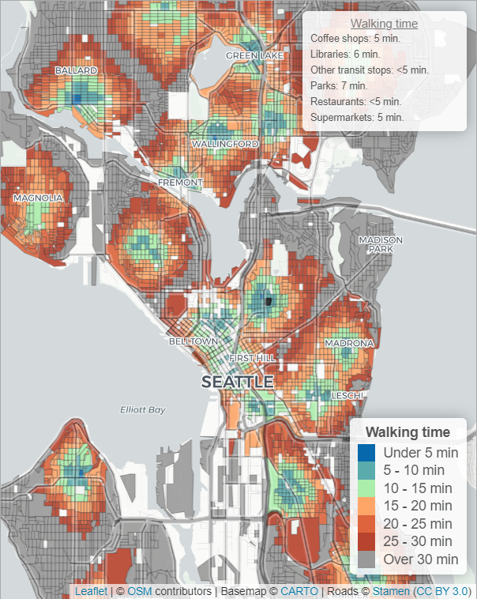

# 15-minute city analysis: reproduction package

Earlier this year, I published an article on my blog titled _[Is Seattle a 15-minute city? It depends on where you want to walk](https://nathenry.com/writing/2023-02-07-seattle-walkability.html)_. The article got a lot of interest both online and in the [Seattle](https://www.seattletimes.com/seattle-news/politics/is-your-part-of-seattle-a-15-minute-neighborhood-check-out-this-map/) [news](https://www.youtube.com/watch?v=OolmqRna8ds), and a fair number of people reached out asking to replicate the analysis for their own city.

The goal of this reproduction package is to empower other people to create their own accessibility analyses tailored to different cities and contexts. Following the instructions in this repository, using only free tools and pulling from publicly-available data, you can create your own interactive web map that shows travel times to the nearest amenities in your city.

## How to use this repository

This project is broken into two parts: in the `analysis/` folder, we download the origin city blocks, destination amenities, and calculate the travel time between them. In the `visualization/` folder, we use the outputs from that analysis to build an interactive web map where users can visualize travel times to different combinations of amenities. Each folder has its own `README.md` file with step-by-step instructions.

If you're not familiar with Git but want to explore this code further, you can download the entire repository by clicking the "Code" button above and selecting "Download ZIP".

After installing some free software tools and tweaking a few folder paths in the configuration file, you should be able to run through the four R scripts in the `analysis/` folder to produce a full walkability analysis for Seattle. A few additional tweaks to the configuration file will allow you to move that analysis to any other city in the US. For cities outside the US, you will need to load city block boundaries from a different source (this project loads them from the US Census), but the general workflow will be the same.

The `visualization/` folder contains example results for Seattle generated from the analysis scripts; other Javascript and CSS helper files for producing the interactive map; and `index.html`, which displays the map. Once you download this repository, you should be able to open `index.html` in your web browser to see the example map for Seattle. When you run your own analysis, simply copy the results from your results folder into `visualization/` to update the interactive map.

Per the MIT license, you can freely adapt any of the code in this repository for your own purposes. If you end up publishing your own analysis inspired by this code, I'd love to see it! You can reach me [over email](https://henryspatialanalysis.com/get-in-touch.html), on [LinkedIn](https://linkedin.com/in/nathenry), or on [Twitter](https://twitter.com/NatMakesMaps).

**If you would like some help to replicate or expand this analysis for your own city, let's talk!** Please [get in touch](https://henryspatialanalysis.com/get-in-touch.html) to discuss your project ideas and needs.

## Changes from the original article

I've tailored this reproduction package to be easily adapted to other cities, destinations, and modes of transit. This required a few changes from the original analysis:

- _Everything happens in the code_: All of the file downloads, reformatting, and edits happen directly in R scripts.
- _All settings are in a configuration file_: The walkability analysis can be reproduced in a different city by changing settings in the `analysis/config.yaml` file.
- _Slightly different destinations_: Because some destinations required too many city-specific tweaks, detailed in the next section.
- _Moving from OpenRouteService to R5_: A big improvement in terms of speed and features, detailed in a later section.

In a full analysis, you would want to extensively vet the list of destinations produced from publicly-available data sources before running estimating travel times. For generality's sake, this repository does not build that step into the code. That means that the results in this repository should only be used as an example, and [the map from the original article](https://nathenry.com/writing/2023-02-07-seattle-walkability.html#walkability) is still the best source for understanding walkability across Seattle.

### Slightly different destinations

In the original Seattle walkability analysis, I included options to visualize walking time to the closest elementary, middle, and high schools in the Seattle Public Schools system. However, because attendance areas often don't reflect proximity, and because of the School Choice and Option School programs, a SPS student's school is often not the one that is geographically closest to them. There are reasonable ways to visualize accessibility to particular sets of schools in the district, but they threatened the generality of this package, so I excluded them as destinations in this example. You can find SPS [school locations](https://data.seattle.gov/dataset/Seattle-Public-Schools-Sites-2022-2023/bd7c-x34g) and [attendance areas](https://data.seattle.gov/dataset/Seattle-Public-Schools-Elementary-School-Attendanc/sfgj-xbjh) on the [Seattle Open Data Portal](https://data.seattle.gov/).

In the original analysis, I also included "Bus stops connecting to downtown" as a candidate destination. This involved figuring out which routes intersected the boundaries of downtown and then including only bus stops for those routes. This analysis involved more Seattle-specific data sources, so to simplify for the replication package I measured distance to any transit stop (with the Link split into its own category) instead.

### Switching from OpenRouteServer to R5

In the original walkability analysis, I spun up an [OpenRouteService](https://openrouteservice.org/) server on my local computer, then repeatedly queried origin-destination pairs using the ["openrouteservice" R package](https://openrouteservice.org/openrouteservice-r-package/). In this analysis, I switched to querying [R5](https://github.com/conveyal/r5) using the ["r5r" R package](https://cran.r-project.org/web/packages/r5r/index.html). There are a lot of things to like about R5 and r5r:

1. _Easier setup_: You can set up and query an R5 Java machine entirely through the "r5r" R interface, compared to a multi-step Docker setup process for OpenRouteService.
2. _Faster and more reliable_: I found that "r5r" was about 100x faster than the OpenRouteService R interface, cycling through the same number of origin-destination pairs in minutes rather than hours. R5 also consistently returned results, requiring less error handling on my end.
3. _More features for measuring urban mobility_: R5 parses GTFS feeds to calculate transit routes; interfaces nicely with the "sf" R package for spatial analysis; and offers more tools for understanding accessibility across multiple transit modes and destinations.

If you want to incorporate real-world traffic, biking, and transit data into your accessibility analysis, please feel free to [get in touch](https://henryspatialanalysis.com/get-in-touch.html)!
